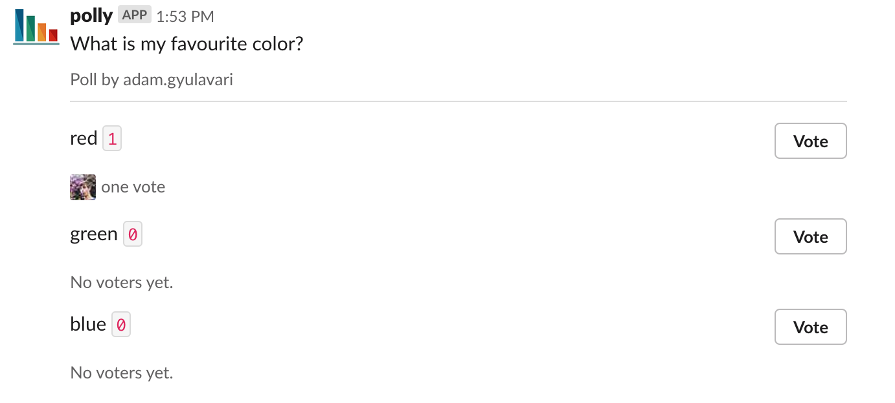
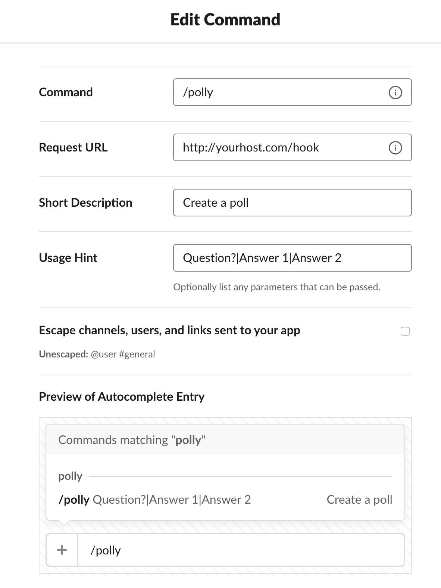
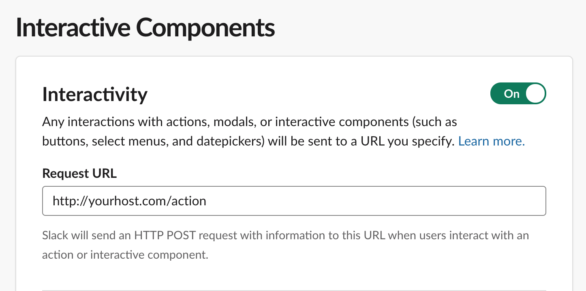
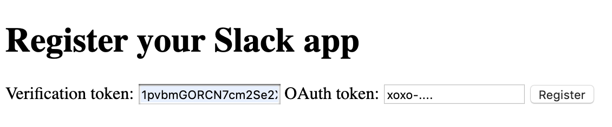

# Polly for Slack

This is a basic open source version for [Slack](https://api.slack.com).

Functionality based on Simple poll, but you can self host it, to have unlimited polls and choices.



*Note: Currently only type of question/poll is supported, where you can vote for multiple choices and remove any of your previous votes*

## Example Usage

`/polly What is my favourite color?|red|green|blue`

Will generate the question above.


## Install

### Server

- Grab a server and install `npm` and `node`
- Grab a mysql database
- Clone the repo
- `npm i`
- Feed it some environment variables (either on the machine or in `.env` file)
```
PORT=3000
DB_URL=localhost
DB_PORT=3306
DB_USER=admin
DB_PASSWORD=yourpassword
DB_NAME=polly
LOG_LEVEL=info
```
- Accepted log levels: `error`, `info`, `debug`
- Specify your Slack token, details below
- Start it up and save it as a startup process with `pm2` if you want
- Optionally forward the requests from `80` to the app with `nginx`

### Slack app

- [Create a Slack app for your organization](https://api.slack.com/apps)
- Create a `Slash command` feature
  - The `command` can be anything, like `/polly`
  - The `Request URL` should be `http://yourserver.com/hook`
  - `Description` can be anything, like `Create a poll, free and unlimited!`
  - `Usage hint` should be `Question?|Answer 1|Answer 2`



- Activate the `Interactive Components` feature
  - The `Request URL` should be `http://yourserver.com/action`



- At the `OAuth & Permissions` feature select the scope `users.profile:read` (so the app can get the profile pictures for voters)
- Install it to your workspace
  - Grab the `OAuth Access Token` and the `Verification Token` and register the created app at `http://yourserver.com/register`



- This way you can have multiple apps using the same polly server (which is needed for different workspaces, unless you want to publish the app)

## Contributing

Feel free to create a PR or fork the repo.

### Could be nice

- Single choice poll creation
- Dockerize the server
- Terraform an AWS EC2 and RDS Free Tier instances and to setup the server with a single command
- More configuration options for questions
